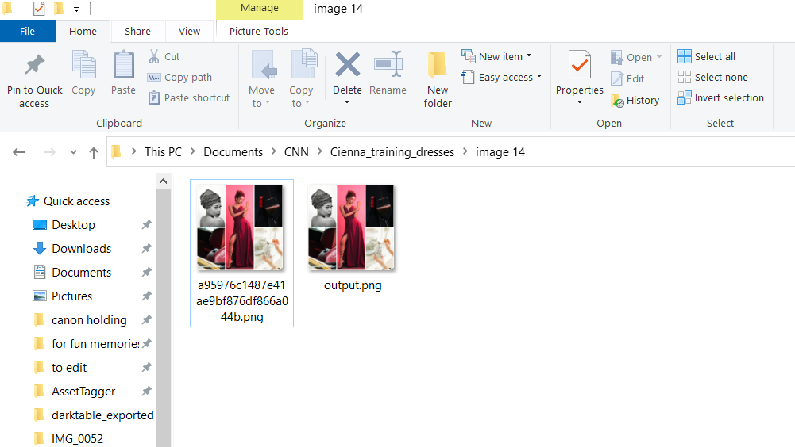

# PNG_Script
This script traverses folders to create a copy of an image titled "output.png"

## Description
This is a short script created for a Neural Network Project I am working on for my class Computational Intelligence.

## Usage

Example of use:

## License

GNU General Public License v3.0
